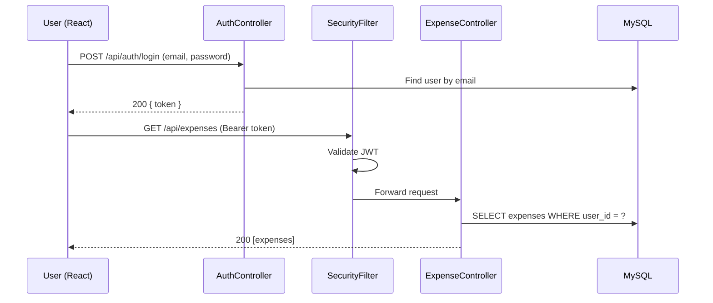

```mermaid
sequenceDiagram
    participant U as User (React)
    participant A as AuthController
    participant S as SecurityFilter
    participant E as ExpenseController
    participant DB as MySQL

    U->>A: POST /api/auth/login (email, password)
    A->>DB: Find user by email
    A-->>U: 200 { token }

    U->>S: GET /api/expenses (Bearer token)
    S->>S: Validate JWT
    S->>E: Forward request
    E->>DB: SELECT expenses WHERE user_id = ?
    E-->>U: 200 [expenses]
```
